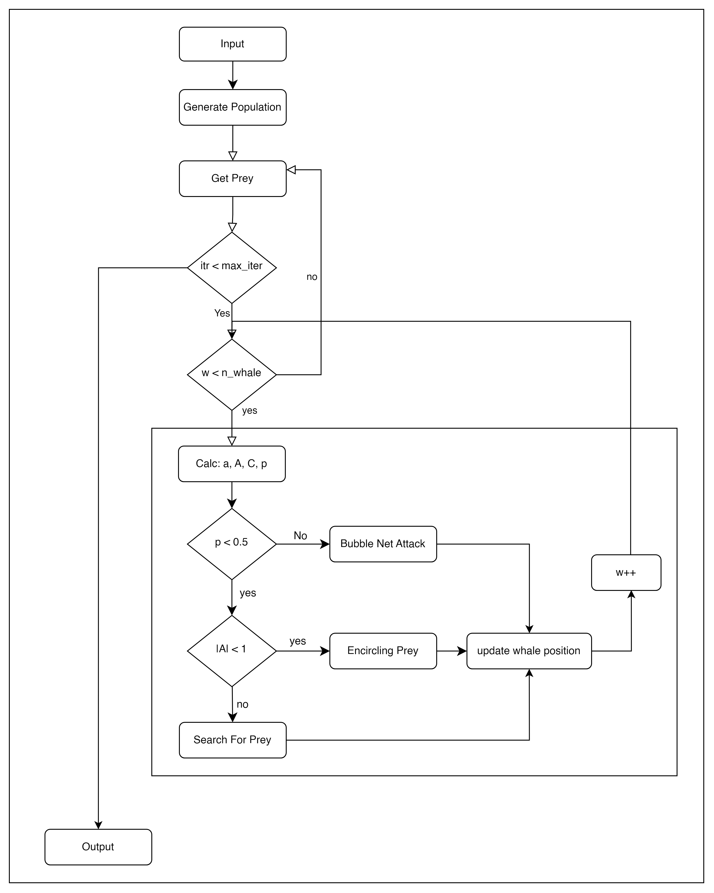
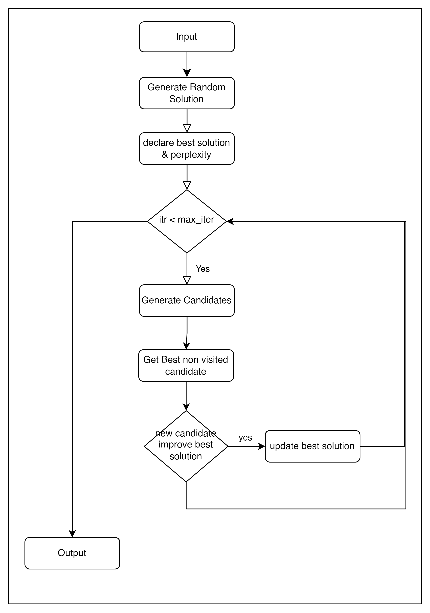

# **Perplexity Permutation Puzzle 2024**
# Hybrid Approach: Whale Optimization Algorithm + Tabu Search

## Introduction

The hybrid approach combining the Whale Optimization Algorithm (WOA) and Tabu Search (TS) aims to solve complex optimization problems, such as minimizing perplexity in word sequences. This method leverages the strengths of both algorithms to efficiently explore the solution space and refine the results.

## 1. Principle of the Hybrid Approach

### Objective

The main objective of this approach is to optimize word permutations to reduce perplexity. The combination of WOA and Tabu Search allows for a broad exploration of the search space while exploiting the best solutions found.

### Key Components

- **Initial Solution:** A random permutation of words.
- **Solution Space:** All possible word permutations (n! permutations).
- **Movement Operators:**
  - For WOA: Movements based on exploration mechanisms inspired by whale behavior.
  - For Tabu Search: Word swaps, sequence inversions, etc.

## 2. Optimization and Refinement of Solutions

### 2.1. Optimization with WOA

#### 1. Generation of Solutions:
   - Create a population of solutions (word permutations).
   - Each whale starts with a random permutation.

#### 2. Movement of Whales:
   - Whales explore the solution space by moving towards the best positions based on fitness criteria (perplexity).
   - Movements are influenced by parameters determining the intensity of exploration, noted as follows:
      - **Parameter A:**
        - **Formula:** `A = 2 * a * r - a`
        - **Where:**
          - **a** is a coefficient that decreases from 2 to 0 over iterations, controlling the transition between exploration and exploitation.
          - **r** is a random number uniformly distributed in the interval `[0, 1]`.
        - **Interpretation:**
          - **A** determines the distance a whale moves from the best position found. A value of A close to 0 favors exploitation (moving closer to the best position), while a high value favors exploration (random movement).

      - **Parameter C:**
        - **Formula:** `C = 2 * r`
        - **Where:**
          - **r** is also a random number uniformly distributed in the interval `[0, 1]`.
        - **Interpretation:**
          - **C** influences the direction of movement towards the best position. A high value of C results in a movement further from the current position, while a low value pushes the whale to move closer to its current position.

#### Summary of Movements:
   - **Encircling Prey:**
     - If `|A| < 1`, the whale uses A and C to move towards the best position found, favoring exploitation.
   - **Search for Prey:**
     - If `|A| ≥ 1`, the whale moves towards a random position in the population, favoring exploration.
   - **Bubble-net Attack:**
     - This movement allows the whale to approach the best position while exploring. By multiplying the distance D between its current position and the best position by a random factor, the whale navigates near this best solution. This creates a balance between exploration and exploitation, promoting a more dynamic search.

#### 3. Update of Solutions:
   - At each iteration, the best solution is updated.

### 2.2. Local Improvement with Tabu Search

#### 1. Initialization of Solutions:
   - The best permutations from the WOA phase are used as starting points for Tabu Search.

#### 2. Exploration of Neighborhoods:
   - Tabu Search explores neighboring solutions by applying movements such as:
     - Swapping two words.
     - Inverting subsequences.
     - Moving words to other positions.

#### 3. Acceptance Criteria:
   - A solution with improved perplexity is always accepted.
   - Less performant solutions may be accepted with a certain probability, favoring exploration.

#### 4. Tabu Mechanism:

   - **Tabu List:** Keeps track of recent movements to avoid revisiting already explored solutions.
   - **Diversification:** Allows exploration of new sectors of the search space while avoiding local minima.

## 3. Integration of WOA and TS Phases

### 3.1. Interactions

- The solutions refined by Tabu Search are used to update the parameters of the WOA algorithm, promoting high-quality trajectories.
- The two phases alternate until a stopping criterion is reached, such as a maximum number of iterations or the absence of significant improvements.

## 4. Stopping Criteria

The hybrid approach stops when:
- A maximum number of iterations is reached.
- Improvements become negligible.

## 5. Advantages of the Hybrid Approach

- **Balance between Exploration and Exploitation:** The combination of WOA and Tabu Search allows for exploring the solution space while refining the best solutions found.
- **Robustness and Adaptability:** This approach is suitable for tackling complex problems where other methods may fail.

## Conclusion

The hybrid approach combining WOA and Tabu Search offers a powerful method for solving optimization problems. By integrating the strengths of both algorithms, it allows for efficient exploration of the solution space and achieving optimal results by minimizing the perplexity of word sequences.
